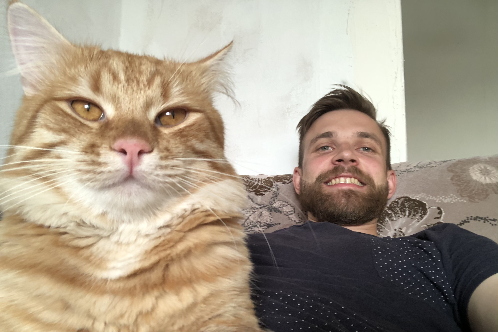

<h3 align="center"> Привет, я Женя Ханецкий	:wink:</h3>

##### Возраст: *29 лет*
##### Проживаю: *Минск*
##### Родной город: *Миоры, Витебская область*
##### Семейное положение: *Женат на самой лучшей девушке*
##### Изучаю: *Курс Front End разработчик в TeachMeSkills*
##### Работаю: *с 2014г. в РУП "Белдорсвязь". Инженер-проектировщик волоконно-оптических линий связи 1 категории*

##### Изучаю полный курс Front End: HTML, CSS и JavaScript с нуля. На курсе я уже разобрался с HTML и CSS. Сейчас активно занимаюсь JavaScript, и подхожу к старту изучения популярного на сегодняшний день фреймворка React.  По окончании курса я планирую изменить свое нынешнее место работы и заниматься Front End разработкой.

##### Увлекаюсь рыбалкой, одна из самых больших моих отдушин в качестве отдыха. Посидеть вечер, ночь и утро на природе у воды, в кругу друзей и порыбачить… Кайф. Занимаюсь тренировками по кроссфиту и баскетболу. Катаю на веле. Люблю приготовить жене и друзьям чего-нибудь вкусное.  Люблю смотреть игры по Dota2 и качаю вара андеда в WOW Classic. Любимое пиво - BUD.

##### Связь со мной:
* E-mail:  khanetsky.zhenya@mail.ru;
* Telegam:  @Zhenya_Khanetsky;
* Instagtram:  @Hanzhk.

##### Это мои работы по HTML, CSS и JavaScript:
* Работа с flex [**Landing page construction company**](https://github.com/Khanetsky-Zhenya/Landing-page-construction-company)
* Работа с grid [**statistic-page**](https://github.com/Khanetsky-Zhenya/statistic-page)
* Работа по JavaScript [**Todo list**](https://github.com/Khanetsky-Zhenya/Todo-list-version_2.0)